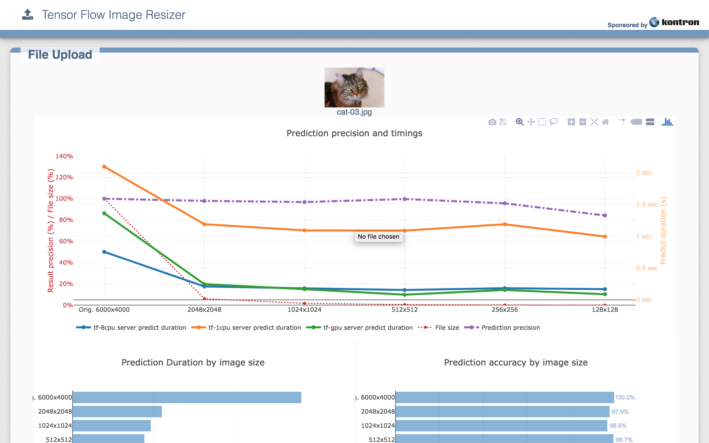
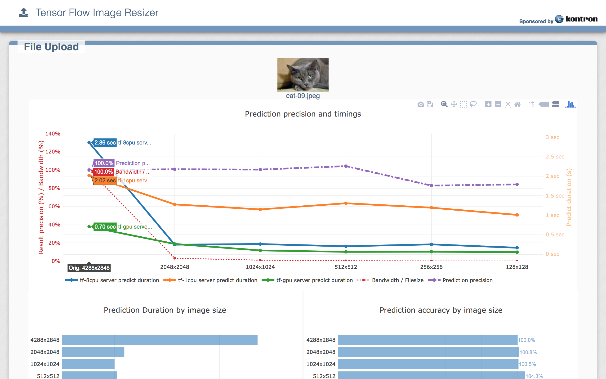
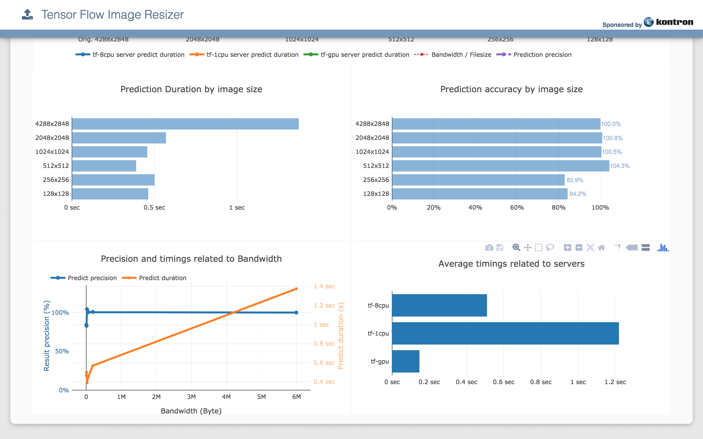

# Having fun with Tensorflow Serving on Kubernetes

There are multiple available walkthroughs available for Tensorflow Serving, to run on K8s or otherwise. But very few that allow you to actually run TF in something that looks more or less like a production system, with an API to publish images. 

There is also literally no data about parameters that influence TF Serving performance. Should you publish PNG images? JPEG? Is performance better if you use a high quality image? 

To answer these questions, I teamed up with [Kontron](https://www.kontron.com/), who provided access to hardware, and [Ronan Delacroix](@ronan_delacroix), the best Python guru I have ever known. 

We did: 

1. Build TF Serving for CPU and GPU, in both optimized and non optimized manner. 
2. Build Docker images with the binaries we just built
3. Look at how to prepare the inception model to be served by TF Serving
3. Build a Kubernetes manifest to deploy TF Serving with various resource constraints
4. Build a web app through which we can publish an image and compare the results
5. Look at the results and draw some conclusions 

And now we want to share that awesome experience. 

# Prerequisites

To replicate this post, you will need access to a Kubernetes 1.6+ cluster, preferrably with GPUs in it. 

In our example here, we used the [Canonical Distribution of Kubernetes](https://www.ubuntu.com/kubernetes) in its version 1.8.7, deployed on a 6 worker cluster using the [Kontron Symkloud MS2911](https://www.kontron.com/products/systems/cloud-systems/symkloud-ms2910.html), 2 of which were equipped with nVidia Tesla P4 cards. 

# Preparing Tensorflow Serving

Building TF Serving "just right" is no easy task, especially as it is a fast moving target. This exercize was based on TF 1.5, and I do not guarantee that it will be reproducible. (I spent a LOT of time getting it right)

## Development Docker Image

First of all we need to build a base image that we can then use to build the various versions of our model server. We could use multistage Docker images, but for the sake of understanding what we are doing, I am just do it manually here. 
The base "FROM" is from the latest CUDA image, so that we can do both CPU and GPU builds, and you can find the source in the repo.

Build with: 

```
$ cd src
$ docker build --rm -t ${USER}/tf-dev -f Dockerfile.tf-dev .
$ cd ..
```

Now we need to download Tensorflow Serving. There was a big change between 1.4 and 1.5 where submodules were removed. This change was not completely taken care of in docs and build systems, so we will need to hack it a little bit here. 

```
$ git clone --recurse-submodules https://github.com/tensorflow/serving
# This will in the end NOT download some required dependencies, so
$ cd serving
$ git clone --recursive https://github.com/tensorflow/tensorflow.git
$ git clone --recursive https://github.com/tensorflow/models.git tf_models
```

At this point, you have a docker image ready as well as the source code to build. Now let's run it 

```
$ docker run --rm -it --name tf-dev -v $PWD/serving:/serving ${USER}/tf-dev bash

```

## Building TF Serving

From there, to build TF Server, you have several options: 

1. GPU, non optimized: 

```
# cd /serving
# bazel build -c opt --config=cuda \
    --crosstool_top=@local_config_cuda//crosstool:toolchain \
    tensorflow_serving/model_servers:tensorflow_model_server \
  && cp bazel-bin/tensorflow_serving/model_servers/tensorflow_model_server \
    /usr/local/bin/tensorflow_model_server.gpu.standard \
  && bazel clean --expunge
```

2. GPU, optimized for Intel processors: 

```
# cd /serving
# bazel build -c opt --config=cuda \
     --crosstool_top=@local_config_cuda//crosstool:toolchain \
     --copt=-msse4.1 --copt=-msse4.2 --copt=-mavx --copt=-mavx2 --copt=-mfma --copt=-O3 \
     tensorflow_serving/model_servers:tensorflow_model_server \
  && cp bazel-bin/tensorflow_serving/model_servers/tensorflow_model_server \
    /usr/local/bin/tensorflow_model_server.gpu.optimized \
  && bazel clean --expunge
```

3. CPU, non optimized 

```
# cd /serving
# bazel build -c opt \
    tensorflow_serving/model_servers:tensorflow_model_server \
  && cp bazel-bin/tensorflow_serving/model_servers/tensorflow_model_server \
    /usr/local/bin/tensorflow_model_server.cpu.standard \
  && bazel clean --expunge
```

4. CPU, optimized for Intel processors: 

```
# cd /serving
# bazel build -c opt \
     --copt=-msse4.1 --copt=-msse4.2 --copt=-mavx --copt=-mavx2 --copt=-mfma --copt=-O3 \
     tensorflow_serving/model_servers:tensorflow_model_server \
  && cp bazel-bin/tensorflow_serving/model_servers/tensorflow_model_server \
    /usr/local/bin/tensorflow_model_server.cpu.optimized \
  && bazel clean --expunge
```

This takes a LOT of time. On my Xeon E5 24 cores, 521 seconds (9min) for the non optimized CPU version, and up to 
1427 seconds (22min) for the optimized GPU version. At the end of the process, you will have these 4 binaries in /usr/local/bin/ of your docker container. 

Now we also need to build another dev binary for the purpose of serving Inception. If you have your own models already you do not need to do this step: 

```
# cd /serving
# bazel build -c opt \
     tensorflow_serving/example:inception_saved_model
```

On a side note, if you run the build on tensorflow_serving/... you will build many more examples, though it will take longer. May be useful for some use cases. 

On a second side note, this is _supposed to_ work, but there is bug reported [here](https://github.com/tensorflow/serving/issues/737) that prevents it from working properly. If you really need this, the good news is that the bitnami docker image **bitnami/tensorflow-inception:latest** contains a working binary at **/opt/bitnami/tensorflow-inception/bazel-bin/tensorflow_serving/example/inception_saved_model**

## Extracting binaries

All the binaries are built, you can now extract them from another shell with: 

```
$ mkdir bin
$ for type in gpu cpu; do
    for version in standard optimized; do
       docker cp tf-dev:/usr/local/bin/tensorflow_model_server.${type}.${version} ./bin/
    done
  done
```

In order to save the tool that we will use to unpack the mode, we commit our docker image with: 

```
$ docker commit tf-dev ${USER}/tf 
```

# Building TF Serving Images

Now that you have all the binaries ready, use them to build relatively small Docker images

Again you will find the sources in the src folder of this repository. You can adapt the files to run the non optimized versions as well

```
$ for type in gpu cpu; do
    docker build --rm -t ${USER}/tf-serving:${type} -f src/Dockerfile.${type} .
    docker push ${USER}/tf-serving:${type}
  done
```

# Creating a servable model 

First of all download the Inception model from the Google Storage: 

```
$ cd /tmp
$ curl -sL http://download.tensorflow.org/models/image/imagenet/inception-v3-2016-03-01.tar.gz
$ tar xfz inception-v3-2016-03-01.tar.gz
$ cd -
```

Now you will need to convert it into something servable by TF Serving: 

```
$ mkdir model-data
$ docker run --rm \
    -v $PWD/model-data:/model-data \
    -v $PWD/serving:/serving \
    -v /tmp/inception-v3:/inception \
    ${USER}/tf \
    /serving/bazel-bin/tensorflow_serving/example/inception_saved_model \
      --checkpoint_dir=/inception \
      --output_dir=/model-data

```

The output of this operation is a subfolder in your model-data folder that contains a saved_model.pb files as well as a variables folder. This is what the model_server uses to serve a model. 

**NOTE**: if you got stuck in the tensorflow bug reported above, use this line: 

```
$ mkdir model-data
$ docker run --rm \
    -v $PWD/model-data:/model-data \
    -v /tmp/inception-v3:/inception \
    bitnami/tensorflow-inception \
    /opt/bitnami/tensorflow-inception/bazel-bin/tensorflow_serving/example/inception_saved_model \
      --checkpoint_dir=/inception \
      --output_dir=/model-data
Welcome to the Bitnami tensorflow-inception container
Subscribe to project updates by watching https://github.com/bitnami/bitnami-docker-tensorflow-inception
Submit issues and feature requests at https://github.com/bitnami/bitnami-docker-tensorflow-inception/issues
Send us your feedback at containers@bitnami.com

2018-02-22 17:25:00.723742: I external/org_tensorflow/tensorflow/core/platform/cpu_feature_guard.cc:137] Your CPU supports instructions that this TensorFlow binary was not compiled to use: SSE4.1 SSE4.2 AVX AVX2 FMA
Successfully loaded model from /inception/model.ckpt-157585 at step=157585.
Exporting trained model to /model-data/1
Successfully exported model to /model-data
```

# Developing a Python Application

Ronan developed an application that does the following: 

* Allow to upload an image (of a cat)
* resize it in several versions from fitting in a 2048x2048 box to fitting in a 128x128 box (we actually did down to 32x32 but the results were not good enough)
* Transcode each version in PNG format and in JPEG format
* Publish each of the versions to 3 Tensorflow servers at the same time
* Display a comparison graph of the results

The code for this app is [here](https://github.com/ronhanson/tensorflow-image-resizer.git) and it is packaged as a docker images you can download with

```
docker pull ronhanson/tensorflow-image-resizer 
```

# Deploying in Kubernetes
## Deploying the model to nodes

OK so I did not have the chance to have any storage available, and I did not want to have issues of bandwidth and IO for my demo. So I used hostPath to store the model (yes I know, shame on me)

You should be able to do something like 

```
$ scp -r model-data <remote-instance>:model-data
```

for each of your worker nodes, then SSH into each of them and :

```
remote-instance:$ sudo mv model-data /
remote-instance:$ exit
```

OK at this stage you have your model shared on all the nodes. Obviously, if you are running in the cloud, use storage classes and publish the content into it. Message me if you are struggling with this step. 

## Deploying TF 

In the src folder, you will find 3 manifests to deploy Tensorflow Serving with a GPU, 1 CPU and 8 CPU cores. Adapt them to your needs (change the TF image and the constraints as needed) then deploy with 

```
kubectl create -f src/manifest-tensorflow-serving-gpu.yaml
kubectl create -f src/manifest-tensorflow-serving-1cpu.yaml
kubectl create -f src/manifest-tensorflow-serving-8cpu.yaml
```

## Deploying the frontend

You will find also in src a manifest to deploy the frontend to K8s. Note that for practical reasons we do the resizing server side in this example, which is CPU intensive. You may change the resource requests to improve response time. 

Also note we are using a nodePort, also for practical reasons. You may change that to something more suited for your use case. 

```
kubectl create -f src/manifest-tensorflow-image-resizer.yaml
```

# Playing with our cluster

Great!! Now you may connect on any of the nodes IP address on port 30501 (http://<node-ip>:30501) and look at the UI: 





# Conclusion

To be honest, some of the conclusions we drew make sense, other are less intuitive. Note that they are findings made on the inception model, and you may have different findings on your own model. We believe this is easy enough to replicate that you can run (and share!!) your results and thoughts

1. Image size (hence bandwidth) has a very low impact on prediction accuracy. This means it is almost always beneficial to resize the image to 1024x1024 or even 512x512 before submitting it to the Tensorflow Serving Model Server. You lose less than 5% accuracy but get a 99% bandwidth saving!! 
  * If you run a publically available system, you may work on resizing the image client side to optimize your pipeline. This is easy enough with javascript (actually Ronan's code has it disabled, but you can very easily switch it on)
  * If you run a datacenter or edge compute, with M2M only, then having a resizing/transcoding pipeline will improve overall performance and save bandwidth. 

2. Image Type DOES matter. You do not see that in the UI directly but you can collect the JSON output, and notice that the same image with the same size is 4 to 5 times longer to analyze in PNG than it is in JPEG. This tells us that clearly compression is good, and that color space is probably not so much of a problem for the performance of the inception model. 

3. Image size does not have so much impact on the duration of the prediction. This one was pretty weird as I expected the prediction to be much much faster with "simpler" images. Well it is not. The neuronet requires as long to decide on a small image as it does on a big one. 

4. 1x GPU (nVidia P4) is roughly equivalent to 8x CPU HT cores of the Intel Xeon once the images have been resized, but it is waaaaay better if you are looking at full scale ones. So I guess here it is a question of use case. 
  * If you are looking for absolute precision, you will need a GPU to get a decent performance
  * If you are looking for speed, then a traditional high density approach with CPUs will probably make more sense

Anyway, we hope you liked this as much as we loved building it! Do not forget to clap for it!! And if you have other use cases or research, Ronan and myself are available to get you started on K8s. 

# References

You may find the code for this here: 

* Python App: https://github.com/ronhanson/tensorflow-image-resizer/
* Blogpost and sources: https://github.com/madeden/blogposts